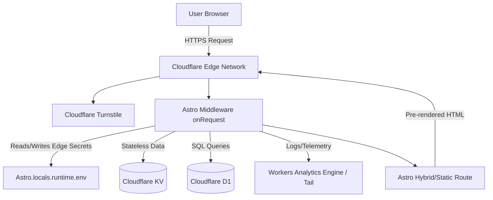

# TerribleTurtles.dev - Software Design Document (SDD)

## 1. Introduction & Domain Strategy
**TerribleTurtles.dev** is designed to be a highly performant portfolio and tool-hosting platform with zero manual maintenance requirements. 

*   **Primary Domain:** `terribleturtles.dev` (Bound directly to the Cloudflare Pages project)
*   **Redirect Domain:** `terribleturtle.dev` (Bound via a Cloudflare Dynamic Redirect Rule: `concat("https://terribleturtles.dev", http.request.uri.path)` using HTTP 301 to prevent SEO duplicate content penalties and map deep links).

## 2. Tech Stack & Deployment Architecture
The platform leverages a modern, serverless edge architecture to guarantee high performance and strict zero-maintenance. 

*   **Framework:** Astro (configured with `output: 'hybrid'` to combine pre-rendered static HTML with on-demand edge middleware and SSR for D1/KV interactions).
*   **Hosting:** Cloudflare Pages (via Wrangler).
*   **Database & Storage:**
    *   **Cloudflare D1 (SQL):** For relational data needs.
    *   **Cloudflare KV (Key-Value):** For fast, globally distributed key-value configurations and stateless caching.
    *   **Cloudflare R2 (File Storage):** For object and large file storage.
*   **Development Workflow:** 100% AI Agent Managed.
*   **Configuration Management:** `wrangler.toml` serves as the single source of truth for Cloudflare Pages bindings (D1, KV, R2) and compatibility flags.

### 2.1 Architecture Request Flow


### 2.2 Native GitHub Integration (Deployment)
Deployments are handled entirely by Cloudflare Pages native GitHub integration, eschewing manual `wrangler pages deploy` workflows. Pushing code to the `main` branch on GitHub automatically triggers Cloudflare's edge build process.
*   **Manual GitHub Link:** AI agents cannot link your GitHub repository to your Cloudflare account. You must manually connect the repo in the Cloudflare Pages dashboard to establish the CI/CD pipeline.
*   **Manual DNS Configuration:** 100% AI-managed code cannot control the domain registrar. The domains (`terribleturtles.dev`) must be manually mapped in the Cloudflare Dashboard, and registrar nameservers must be updated accordingly.

## 3. Design Tokens & Component Architecture (The "Best Friend's House" Vibe)
The aesthetic is welcoming, highly competent, modern, and clean, strictly avoiding corporate gloss or "AI slop" filler.

*   **Base Background:** Deep Charcoal (`#121212`)
*   **Surface (Cards/Panels):** Elevated Soft Black (`#1C1C1C`)
*   **Text (Primary):** Off-White (`#F4F4F4`)
*   **Text (Muted):** Cool Gray (`#64748B`)
*   **Accent (Primary):** Slate/Flat Tech Green (`#2A9D8F`)
*   **Borders:** 1px solid `#2E2E2E` (Grounds elements; replaces heavy corporate drop-shadows).
*   **Border Radius:** 6px to 8px (Soft but structured).
*   **Spacing:** Generous internal padding for breathing room.
*   **Primary Typography:** Clean Sans-Serif (Modern, highly readable).
*   **Code Typography:** Monospace (Strictly for code blocks and CLI commands).

### Component Architecture
Astro components must be highly modular to enforce strict design tokens. 
*   **Base Layout Wrappers:** Handle global padding, typography, and injection of CSS variables.
*   **Reusable UI Cards:** Ensure consistent border radiuses, borders, and surfaces across "Tools" and "Sites" buckets.

## 4. Architecture, Navigation & Content Strategy
The platform utilizes a "Bucket System": projects are built, placed in "Tools" or "Sites", and left to run.

*   **Header Menu:** Home, Tools, Sites.
*   **Footer Menu:** About, Privacy, Security, Changelog / RSS.
*   **System Pages:** Branded static 404 Error page routing back to active projects.

### 4.1 Core Route Mapping
*   `src/pages/index.astro`: Homepage (Welcome, Current Project, Archive Grid).
*   `src/pages/tools/[slug].astro`: Dynamic routing for utility tools.
*   `src/pages/sites/[slug].astro`: Dynamic routing for hosted/archived sites.
*   `src/pages/api/[endpoint].ts`: Serverless endpoints for specific tool logic.

### 4.2 Handling "Bucket System" Bit-Rot
While projects are intended to be zero-maintenance, external APIs deprecate. 
*   **Policy:** If an archived tool's external dependency fails, it will gracefully degrade into a "Static Showcase Mode" or display an automated "Deprecated: Requires Update" banner rather than breaking the parent UI.

### 4.3 High ROI Upgrades
*   **View Transitions:** App-like, seamless page loads without browser flashing.
*   **Command Palette (Cmd+K):** Keyboard-triggered search to filter projects via tags.

## 5. Data, State & Security Architecture

### 5.1 Secret & Credential Management
*   **Mechanism:** Provisioning via Cloudflare Edge Network.
*   **Implementation:** Keys are injected into the Cloudflare network using the `wrangler secret put` command.
*   **Boundary:** The codebase is prohibited from holding raw keys. Runtime Cloudflare bindings (D1, KV, R2) and edge secrets in Astro must be securely accessed via `Astro.locals.runtime.env` or the `astro:env/server` module. `import.meta.env` is reserved strictly for build-time static variables.

### 5.2 Privacy-First Error Tracking & Logging
*   **Mechanism:** Native Cloudflare Tail Logs + Workers Analytics Engine.
*   **Implementation:** Custom Astro middleware (`src/middleware.ts`) intercepts exceptions. Since KV writes are subject to strict rate limits and eventual consistency, telemetry and error metadata (with stripped PII) are passed natively to `console.error` (viewable via Cloudflare Tail) or structured via Cloudflare Workers Analytics Engine. No third-party trackers are used.

### 5.3 Backup & Disaster Recovery
*   **Mechanism:** Cloudflare D1 Native "Time Travel".
*   **Implementation:** Relies entirely on D1's Time Travel append-only log of database bookmarks, allowing point-in-time recovery within a 30-day rolling window. 
*   **Constraint Note:** Time Travel performs a *full database state rollback*. It does not support restoring individual tables or rows natively; recovering specific records requires extracting data from a restored point prior to resuming operations.

### 5.4 Data Models & Schemas
*   **D1 Tables:** Will vary by tool, but must follow strict normalized schemas (e.g., `projects` table for global metadata, `tool_state` table for specific utilities).
*   **D1 Migrations:** Changes to the database schema cannot be done via raw runtime queries. All schema changes require explicit, version-controlled SQL migration files (e.g., `0001_create_table.sql`) and must be applied via `wrangler d1 migrations apply`.
*   **KV Structure:** Used exclusively for fast-read configurations, feature flags, or heavily cached semi-static responses. (e.g., key: `config:theme:dark_mode`).

### 5.5 Client-Side State Boundaries
*   **Mechanism:** Vanilla Web Storage API.
*   **Implementation:** Persistent user state (e.g., dark-mode, configurations) is strictly bound to the browser's native `localStorage` or `sessionStorage`. Zero server-side session syncing or cookies.

## 6. Strict Non-Functional Requirements (NFRs)
All NFRs must be objectively verifiable prior to deployment:
*   **Perfect Speed:** Time to First Byte (TTFB) < 50ms and a 100/100 Lighthouse Performance score, achieved via hybrid architecture and zero unnecessary JS.
*   **Perfect Privacy:** Zero cookies, zero third-party tracking scripts. Analytics restricted to Cloudflare Web Analytics (server-side, cookie-free).
*   **Perfect Security:** Cloudflare enterprise DDoS protection, Turnstile bot protection, and an A+ Mozilla Observatory Score.
*   **Perfect Accessibility:** WCAG 2.1 AA Compliant semantic HTML, high-contrast color ratios, and full screen-reader support via ARIA tagging.

**Wrangler CSP Spec Example:**
The CSP strictly enforces domains while accommodating necessary Cloudflare utilities:
```toml
[[headers]]
  for = "/*"
  [headers.values]
    Content-Security-Policy = "default-src 'self'; img-src 'self' data:; style-src 'self' 'unsafe-inline'; script-src 'self' https://challenges.cloudflare.com https://static.cloudflareinsights.com; frame-src 'self' https://challenges.cloudflare.com;"
```

## 7. AI Development Guardrails & Workflow
Crucial instructions for any LLM or AI agent interacting with the codebase:
1.  **Strict Style Enforcement:** Agents are forbidden from writing inline styles, using random hex colors, or overriding the Design Tokens. Components must use semantic HTML and token-mapped utility classes.
2.  **Dependency Lockdown:** Installing new npm packages or adding third-party scripts requires explicit human authorization. No exceptions.
3.  **Automated Quality Gates:** Any AI PR must pass CI/CD checkpoints (Astro builds, strict TypeScript compilation, accessibility/Lighthouse auditing) prior to merge.
4.  **Zero Tracking Mandate:** Enforce the zero-cookie policy. Agents must not inject iframes, external analytic tracking scripts, or non-approved third-party API calls under any circumstance.
5.  **The "Node.js Mirage":** Cloudflare Edge runs on `workerd`, not Node.js. Agents are strictly forbidden from installing npm packages that rely on native Node.js modules (`fs`, `child_process`, `crypto`, `sharp`). Rely solely on edge-compatible Web APIs.
6.  **Image Optimization Constraints:** Astro's default `<Image />` component relies on Node.js (Sharp) and fails on Cloudflare Pages. Agents must either pre-optimize images locally or explicitly configure Astro to use Cloudflare's native Image Resizing service.

## 8. Manual User Setup Guide (Non-AI Tasks)
Because AI agents operate locally and cannot securely authenticate into your Cloudflare or GitHub dashboards, the human user **must** perform the following manual setup actions:

1.  **Repository Connection:** Create a GitHub repository, push the local code, and log into the Cloudflare Pages dashboard to "Connect to Git" and enable automatic deployments.
2.  **Provision Cloudflare Resources:** Run the following commands in your terminal (while authenticated to Cloudflare) to create the remote resources, then provide the resulting IDs to the AI to place in `wrangler.toml`:
    *   `npx wrangler d1 create terribleturtles-db`
    *   `npx wrangler kv:namespace create "CONFIG_KV"`
3.  **Secure Secret Injection:** AI cannot manage live production secrets. You must inject them manually via the dashboard or CLI:
    *   `npx wrangler pages secret put TURNSTILE_SECRET_KEY`
4.  **Turnstile Provisioning:** Log into the Cloudflare Dashboard, navigate to Turnstile, create a new site for `terribleturtles.dev`, and provide the public Site Key to the AI.
5.  **DNS & Custom Domain:** Add `terribleturtles.dev` to Cloudflare, update your registrar's nameservers, and bind the Custom Domain to your Pages project in the Cloudflare dashboard.
